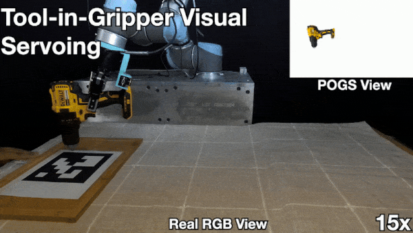

## Persistent Object Gaussian Splat (POGS) for Tracking Human and Robot Manipulation of Irregularly Shaped Objects

<div align="center">

[[Website]](https://berkeleyautomation.github.io/POGS/)
<!-- [[PDF]](https://autolab.berkeley.edu/assets/publications/media/2024_IROS_LEGS_CR.pdf) -->
<!-- [[Arxiv]](https://arxiv.org/abs/2409.18108) -->

<!-- insert figure -->
<!--  -->

<div style="height: 50px;">&nbsp;</div>

<div style="height: 50px;">&nbsp;</div>

<!--  -->
</div>

This repository contains the official implementation for [POGS](https://berkeleyautomation.github.io/POGS/).

Tested on Python 3.10, cuda 11.8, using conda. 

## Installation
1. Create conda environment and install relevant packages
```
conda create --name pogs_env -y python=3.10
conda activate pogs_env
conda install -c "nvidia/label/cuda-11.8.0" cuda-toolkit

pip install torch==2.6.0 torchvision==0.21.0 --index-url https://download.pytorch.org/whl/cu118

pip install ninja git+https://github.com/NVlabs/tiny-cuda-nn/#subdirectory=bindings/torch
pip install jaxtyping rich
pip install gsplat --index-url https://docs.gsplat.studio/whl/pt20cu118
pip install warp-lang
```

2. [`cuml`](https://docs.rapids.ai/install) is required (for global clustering).
The best way to install it is with pip: `pip install --extra-index-url=https://pypi.nvidia.com cudf-cu11==25.4.* cuml-cu11==25.4.*`

3. Install POGS!
```
git clone https://github.com/uynitsuj/POGS.git --recurse-submodules
cd POGS
python -m pip install -e .
python -m pip install pogs/dependencies/nerfstudio/
pip install fast_simplification==0.1.9
pip install numpy==1.26.4
ns-install-cli
```
### Robot Interaction Code Installation (UR5 Specific)

There is also a physical robot component with the UR5 and ZED 2 cameras. To install relevant libraries:
#### ur5py
```
pip install ur_rtde==1.4.2 cowsay opt-einsum pyvista autolab-core
pip install -e /pogs/dependencies/ur5py
```

#### RAFT-Stereo
```
cd ~/POGS/pogs/dependencies/raftstereo
bash download_models.sh
pip install -e .
```

#### Contact-Graspnet
Contact Graspnet relies on some older library setups, so we couldn't merge everything into 1 conda environment. However, we can make it work by making this separate conda environment and then calling it in a subprocess.
```
conda deactivate
conda create --name contact_graspnet_env python=3.8
conda activate contact_graspnet_env
conda install -c conda-forge cudatoolkit=11.2
conda install -c conda-forge cudnn=8.2
# If you don't have cuda installed at /usr/local/cuda then you can install on your conda env and run these two lines
conda install -c conda-forge cudatoolkit-dev
export CUDA_HOME=/path/to/anaconda/envs/contact_graspnet_env/bin/nvcc
pip install tensorflow==2.5 tensorflow-gpu==2.5
pip install opencv-python-headless pyyaml pyrender tqdm mayavi
pip install open3d==0.10.0 typing-extensions==3.7.4 trimesh==3.8.12 configobj==5.0.6 matplotlib==3.3.2 pyside2==5.11.0 scikit-image==0.19.0 numpy==1.19.2 scipy==1.9.1 vtk==9.3.1
# if you have cuda installed at /usr/local/cuda run these lines
cd ~/POGS/pogs/dependencies/contact_graspnet
sh compile_pointnet_tfops.sh
# if you have cuda installed on your conda env run these lines
cd ~/POGS/pogs/configs
cp conda_compile_pointnet_tfops.sh ~/pogs/pogs/dependencies/contact_graspnet/
cd ~/POGS/pogs/dependencies/contact_graspnet
sh conda_compile_pointnet_tfops.sh
pip install autolab-core
```

#### Download Models and Data
##### Model
Download trained models from [here](https://drive.google.com/drive/folders/1tBHKf60K8DLM5arm-Chyf7jxkzOr5zGl?usp=sharing) and copy them into the `checkpoints/` folder.
##### Test data
Download the test data from [here](https://drive.google.com/drive/folders/1TqpM2wHAAo0j3i1neu3Xeru3_WnsYQnx?usp=sharing) and copy them them into the `test_data/` folder.

## Usage
### Calibrate wrist mounted and third person cameras
Before training/tracking POGS, make sure wrist mounted camera and third-person view camera are calibrated. We use an Aruco marker for the calibration
```
conda activate pogs_env
cd ~/POGS/pogs/scripts
python calibrate_cameras.py
```

### Scene Capture
Script used to perform hemisphere capture with robot on tabletop scene. We used manual trajectory but you can also put the robot in "teach" mode to capture trajectory.
```
conda activate pogs_env
cd ~/POGS/pogs/scripts
python scene_capture.py --scene DATA_NAME
```

### Train POGS
Script used to train the POGS for 4000 steps
```
conda activate pogs_env
ns-train pogs --data /path/to/data/folder
```
Once the POGS has completed training, there are N steps to then actually define/save the object clusters.
1. Hit the cluster scene button.
2. It will take 10-20 seconds, but then after, you should see your objects as specific clusters. If not, hit Toggle RGB/Cluster and try to cluster the scene again but change the Cluster Eps (lower normally works better).
3. Once you have your scene clustered, hit Toggle RGB/Cluster.
4. Then, hit Click and click on your desired object (green ball will appear on object).
5. Hit Crop to Click, and it should isolate the object.
6. A draggable coordinate frame will pop up to indicate the object's origin, drag it to where you want it to be. (For experiments, this was what we used to align for object reset or tool servoing)
7. Hit Add Crop to Group List
8. Repeat steps 4-7 for all objects in scene
9. Hit View Crop Group List
Once you have trained the POGS, make sure you have the config file and checkpoint directory from the terminal saved.

### Run POGS for grasping
Script for letting you use a POGS to track an object online and grasp it.
```
conda activate pogs_env
python ~/POGS/pogs/scripts/track_main_online_demo.py --config_path /path/to/config/yml
```

## Bibtex
If you find POGS useful for your work please consider citing:
```
@article{yu2025pogs,
  author    = {Yu, Justin and Hari, Kush and El-Refai, Karim and Dalil, Arnav and Kerr, Justin and Kim, Chung-Min and Cheng, Richard, and Irshad, Muhammad Z. and Goldberg, Ken},
  title     = {Persistent Object Gaussian Splat (POGS) for Tracking Human and Robot Manipulation of Irregularly Shaped Objects},
  journal   = {ICRA},
  year      = {2025},
}
```

## End-to-End POGS-ACT Offline Dataset Workflow (Including CoppeliaSim Data Capture)

Here is the exact step-by-step workflow required to capture the scene, clear corrupted caches, train the Gaussian Splat, label the masks in the UI, extract pointclouds, and generate the final `[1024]` PointNet++ embeddings for ACT policy training.

### 1. Scene Capture
Capture RLBench offline trajectories from CoppeliaSim for POGS. Make sure to expose the simulator root and Python paths avoiding library conflicts.
```bash
conda activate pogs_env

export COPPELIASIM_ROOT=/home/pi0/CoppeliaSim
export LD_LIBRARY_PATH=$COPPELIASIM_ROOT:$LD_LIBRARY_PATH
export QT_QPA_PLATFORM_PLUGIN_PATH=$COPPELIASIM_ROOT
export PYTHONPATH=$PYTHONPATH:/home/pi0/POGS-ACT-implementation/POGS/PointCloudMatters

cd /home/pi0/POGS-ACT-implementation/POGS/POGS
python pogs/scripts/capture_rlbench_scene.py \
    --task        open_drawer \
    --episode     0 \
    --data-root   /home/pi0/POGS-ACT-implementation/POGS/PointCloudMatters/data/rlbench/raw/train \
    --out-dir     data/pogs_scenes/open_drawer/shared \
    --n-views     100
```

### 2. Clear Caches & Train POGS
Before training, nuke polluted library paths and any outdated DINO/CLIP caches so `ns-train` gracefully extracts features for all frames.
```bash
conda activate pogs_env

# 1. Completely nuke the polluted library paths that might cause a crash
unset LD_LIBRARY_PATH
unset LIBRARY_PATH

# 2. Re-add ONLY the pure POGS environment libraries
export POGS_ENV_ROOT="/home/pi0/miniconda3/envs/pogs_env"
export LD_LIBRARY_PATH="$POGS_ENV_ROOT/lib"

# 3. If you get out-of-dimension errors due to old cache, delete them:
rm -f /home/pi0/POGS-ACT-implementation/POGS/POGS/outputs/shared/dino.*
rm -f /home/pi0/POGS-ACT-implementation/POGS/POGS/outputs/shared/*.npy
rm -f /home/pi0/POGS-ACT-implementation/POGS/POGS/outputs/shared/*.info
rm -rf /home/pi0/POGS-ACT-implementation/POGS/POGS/outputs/shared/clip_*
rm -f /home/pi0/POGS-ACT-implementation/POGS/POGS/outputs/shared/detic.npy

# 4. Train the scene!
cd /home/pi0/POGS-ACT-implementation/POGS/POGS
ns-train pogs --data data/pogs_scenes/open_drawer/shared
```

### 3. Extract the Point Cloud (Optional Sanity Check)
Extract the geometric baseline out into `.ply` meshes if desired:
```bash
mkdir -p data/pogs_act/open_drawer
python pogs/scripts/export_pogs_pointcloud.py \
    --checkpoint outputs/shared/pogs/try/nerfstudio_models/step-000003000.ckpt \
    --out data/pogs_act/open_drawer/shared.ply \
    --max-points 8192
```

### 4. Segment and Save the Gaussian Cluster Masks
Open Viser UI and cluster your objects for downstream PointNet processing.
```bash
python scripts/run_pogs_ui.py --load-config outputs/shared/pogs/2026-04-03_010833/config.yml
```
**UI Actions Required:**
1. Hit **Cluster Scene** (Wait 10-20 seconds).
2. Hit **Toggle RGB/Cluster** to verify object isolation.
3. Hit **Click**, then click on your target object in the scene.
4. Hit **Crop to Click** to isolate.
5. Hit **Add Crop to Group List**.
6. Hit **Export Group** (saves your `outputs/shared/clusters.npy` to disk).

### 5. Generate ACT Dataset (Extracting PointNet++ Embeddings Online)
Run the dataset generation script. It processes the observations, uses your exported `clusters.npy`, and runs your DINO/Detic/RGB/XYZ frames straight through PointNet++ into a 1024-dim ACT payload.
```bash
python pogs/scripts/generate_pogs_act_dataset.py \
  --task open_drawer \
  --raw-root /home/pi0/POGS-ACT-implementation/POGS/PointCloudMatters/data/rlbench/raw/train \
  --pogs-config outputs/shared/pogs/2026-04-03_010833/config.yml \
  --out-dir exports/act_datasets/ \
  --pointnet2-ckpt /home/pi0/POGS-ACT-implementation/POGS/Pointnet_Pointnet2_pytorch/log/sem_seg/pointnet2_sem_seg/checkpoints/best_model.pth
```
