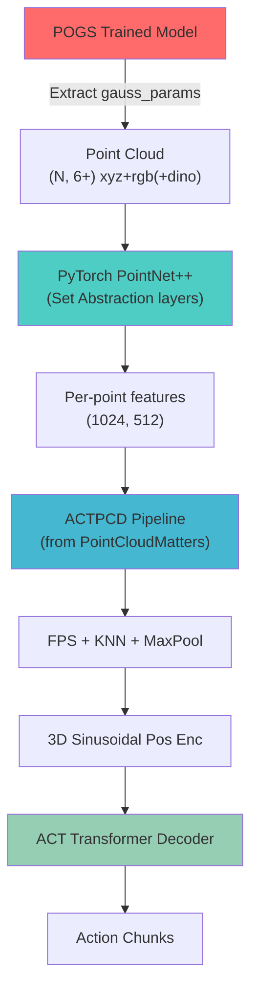

# PointNet++ × ACT × POGS: Integration Analysis

## TL;DR

**Yes, PointNet++ can work with ACT and POGS output.** You already have most of the infrastructure in your repo. Below is the full analysis with literature, architecture options, and a concrete integration path.

---

## 1. Relevant A/A* Conference Papers

| Paper | Venue | Point Cloud Encoder | Policy | Key Insight |
|---|---|---|---|---|
| **Point Cloud Matters (PCM)** | NeurIPS 2024 D&B | Sparse-conv PointNet, SPUNet | **ACT**, Diffusion Policy | PCD outperforms RGB/RGBD; FPS + KNN grouping → ACT decoder |
| **3D Diffusion Policy (DP3)** | RSS 2024 | Simple MLP (benchmarks PointNet++) | Diffusion Policy | PointNet++ is competitive but MLP is faster; T-Net/BN overhead |
| **RISE** | IROS 2024 | Sparse 3D encoder (SparseConv) | Diffusion head | Single-view PCD → sparse encoder → transformer → action |
| **PolarNet** | CoRL 2023 | **PointNext** (upgraded PointNet++) | Language-conditioned policy | Uses PointNet++ successor for RLBench; data-efficient |
| **PointFlowMatch** | CoRL 2024 | Modified PointNet | Conditional Flow Matching | 67.8% avg success on RLBench; 2× next best |
| **ManiGaussian** | CVPR 2024 | Gaussian embedding space | Language-conditioned | Mines scene dynamics through Gaussian Splatting future reconstruction |
| **RoboSplat** | RSS 2025 | 3DGS-based augmentation | Visuomotor policy | One-shot manipulation from 3DGS novel demonstrations |
| **PointMapPolicy** | NeurIPS 2025 | Structured point grids | Diffusion Policy | No downsampling; references PointNet++ |

> [!IMPORTANT]
> **PolarNet (CoRL 2023)** is perhaps the most directly relevant precedent — it uses **PointNext**, which is literally "PointNet++ with improved training and scaling strategies." This validates that PointNet++-family encoders work well for robot policy learning.

---

## 2. How PCM Already Works in Your Repo

Your repo's `PointCloudMatters/` implements the [ACTPCD](file:///c:/Users/parth/Desktop/WORK/College%20Padhai/pogs/POGS/PointCloudMatters/src/models/components/act/act.py#312-599) class in [act.py](file:///c:/Users/parth/Desktop/WORK/College%20Padhai/pogs/POGS/PointCloudMatters/src/models/components/act/act.py):

```
Point Cloud (N, 6) [xyz + rgb]
        │
        ▼
┌─────────────────┐
│  PointNet/SPUNet │  ← Sparse conv backbone (pcd_encoder/)  
│  (per-point 512d)│
└────────┬────────┘
         │
         ▼
┌─────────────────┐
│  FPS downsample  │  ← Farthest Point Sampling to 1024 pts
│  + KNN grouping  │  ← k=16 neighbors, local aggregation
│  + MaxPool        │
└────────┬────────┘
         │
         ▼
┌─────────────────┐
│  Sinusoidal 3D   │  ← Positional encoding from xyz coords
│  Pos Embedding    │
└────────┬────────┘
         │
         ▼
┌─────────────────┐
│  ACT Transformer │  ← Same CVAE encoder-decoder as image ACT
│  Decoder          │  ← latent z + proprio + PCD tokens → actions
└─────────────────┘
```

The backbone is a **sparse-conv PointNet** (NOT PointNet++). It uses `spconv.SubMConv3d` with kernel_size=1, which makes it essentially a per-point MLP — no hierarchical set abstraction.

---

## 3. How PointNet++ Differs and Why It Matters

| Feature | PCM's PointNet | PointNet++ (SSG/MSG) |
|---|---|---|
| Local geometry | ❌ No explicit local grouping in encoder | ✅ Ball query + set abstraction at multiple scales |
| Hierarchical features | ❌ Flat per-point processing | ✅ Multi-scale hierarchical (128→64→32 point regions) |
| Scale awareness | ❌ Single scale | ✅ MSG: multiple radii at each level |
| Feature propagation | ❌ None | ✅ Upsampling via interpolation + skip connections |

> [!TIP]
> PointNet++ would capture **multi-scale local geometry** that the current sparse-conv PointNet misses. For irregularly shaped objects (which POGS specifically targets), this hierarchical understanding could be valuable.

### The Case FOR PointNet++ with ACT:
- POGS deals with **irregularly shaped objects** — PointNet++'s multi-scale local geometry understanding is especially suited for this
- PCM's current PointNet encoder does FPS + KNN *after* backbone encoding (~post-hoc local aggregation). PointNet++ does this *within* the encoder (more principled)
- PolarNet (CoRL 2023) already validates the PointNet++ family for robot policy learning

### The Case Against (Nuances):
- DP3 (RSS 2024) found simple MLP competitive with PointNet++ for their tasks
- Sparse-conv approaches (RISE, PCM) are often faster at inference
- PointNet++ requires CUDA ops (ball query, FPS) that can be library-dependent

---

## 4. Concrete Integration Path: PointNet++ as PCM Backbone

The cleanest way to integrate PointNet++ is to **replace PCM's PointNet backbone** while keeping the rest of the ACTPCD pipeline intact.

### Architecture

```
POGS Gaussians
        │
        ▼ (extract means + SH2RGB colors)
Point Cloud (N, 6) [xyz + rgb]
        │
        ▼
┌──────────────────────┐
│  PointNet++ Encoder   │  ← PyTorch PointNet++ (Set Abstraction layers)
│  SA(1024, 0.1, 32)   │  ← Level 1: sample 1024 pts, radius 0.1, 32 neighbors
│  SA(256, 0.2, 64)    │  ← Level 2: sample 256 pts, radius 0.2, 64 neighbors  
│  SA(64, 0.4, 128)    │  ← Level 3: sample 64 pts, radius 0.4, 128 neighbors
│  → 512-dim features  │
└──────────┬───────────┘
           │
           ▼
┌──────────────────────┐
│  Feature Propagation  │  ← Upsample back to 1024 points (optional)
│  OR Global Feature    │  ← Max-pool to single 512-dim vector
└──────────┬───────────┘
           │
           ▼
    (same ACT pipeline as PCM's ACTPCD)
    FPS → KNN grouping → Sinusoidal pos → Transformer decoder → Actions
```

### Two Sub-Options

**Option A: PointNet++ as drop-in backbone (simpler)**
- Replace [pcd_encoder/pointnet.py](file:///c:/Users/parth/Desktop/WORK/College%20Padhai/pogs/POGS/PointCloudMatters/src/models/components/pcd_encoder/pointnet.py) with a PyTorch PointNet++ module
- Output per-point features (N, 512), let ACTPCD's existing FPS + KNN handle downsampling
- Minimal changes to [ACTPCD](file:///c:/Users/parth/Desktop/WORK/College%20Padhai/pogs/POGS/PointCloudMatters/src/models/components/act/act.py#312-599) class

**Option B: PointNet++ replaces backbone + FPS/KNN (cleaner)**  
- PointNet++'s set abstraction layers *already include* FPS + ball query + local grouping
- Skip ACTPCD's separate FPS + KNN step; use PointNet++'s hierarchical output directly
- Rearrange output tokens for ACT transformer input

> [!NOTE]
> **Option A is recommended** for a first pass — it minimizes changes and lets you validate the approach before deeper refactoring.

### PyTorch PointNet++ Sources
- **PyTorch Geometric** (`torch_geometric.nn.PointNetConv`) — well-maintained, GPU-optimized
- **Pointnet2_PyTorch** (Erik Wijmans) — standalone, commonly used in robotics papers
- **PointNext** (from PolarNet lineage) — modernized PointNet++ with better training recipes

---

## 5. POGS Output Compatibility

POGS stores Gaussian parameters in `gauss_params`:

| Parameter | Shape | For Point Cloud |
|---|---|---|
| `means` | (N, 3) | ✅ Directly used as xyz coordinates |
| `features_dc` (SH coeffs) | (N, 3) | ✅ Convert via [SH2RGB()](file:///c:/Users/parth/Desktop/WORK/College%20Padhai/pogs/POGS/pogs/pogs_pipeline.py#67-73) → rgb colors |
| `scales` | (N, 3) | Can encode local shape info (optional extra features) |
| `quats` | (N, 4) | Can encode orientation (optional extra features) |
| `opacities` | (N, 1) | Filter low-opacity Gaussians (noise removal) |
| `dino_feats` | (N, 64) | Rich semantic features — could augment point cloud! |

### What you get from POGS → Point Cloud:
```python
# Already in pogs_pipeline.py _export_visible_gaussians()
xyz = model.means.cpu().numpy()           # (N, 3)
rgb = SH2RGB(model.features_dc)           # (N, 3) 
# → 6-channel point cloud (N, 6) — exactly what PCM expects

# BONUS: POGS also has per-Gaussian DINO features
dino = model.gauss_params['dino_feats']   # (N, 64)
# → Could make a (N, 6+64) = (N, 70) enriched point cloud!
```

> [!IMPORTANT]
> **POGS gives you MORE than a typical RGBD camera.** Beyond xyz+rgb, you have:
> - **DINO semantic features** (64-dim) per Gaussian — these encode rich object-level semantics
> - **Scale information** — encodes local geometry size
> - **Cluster labels** — per-Gaussian object segmentation
> - **CLIP features** — language-grounded features via hash encoding
> 
> This is a richer representation than any depth camera could provide, and PointNet++ is well-suited to process these high-dimensional per-point features.

---

## 6. Recommended Approach Summary



1. **Use PCM's ACTPCD as the scaffold** (already in your repo)
2. **Swap PointNet backbone → PyTorch PointNet++** (Option A: drop-in replacement)
3. **Feed POGS Gaussians as enriched point clouds** (xyz + rgb + optionally DINO feats)
4. **Start with 6-channel** (xyz+rgb) to match existing configs, then experiment with appending DINO features

This gives you the **best of both worlds**: PCM's proven ACT integration + PointNet++'s hierarchical geometry understanding + POGS's rich per-Gaussian features.
